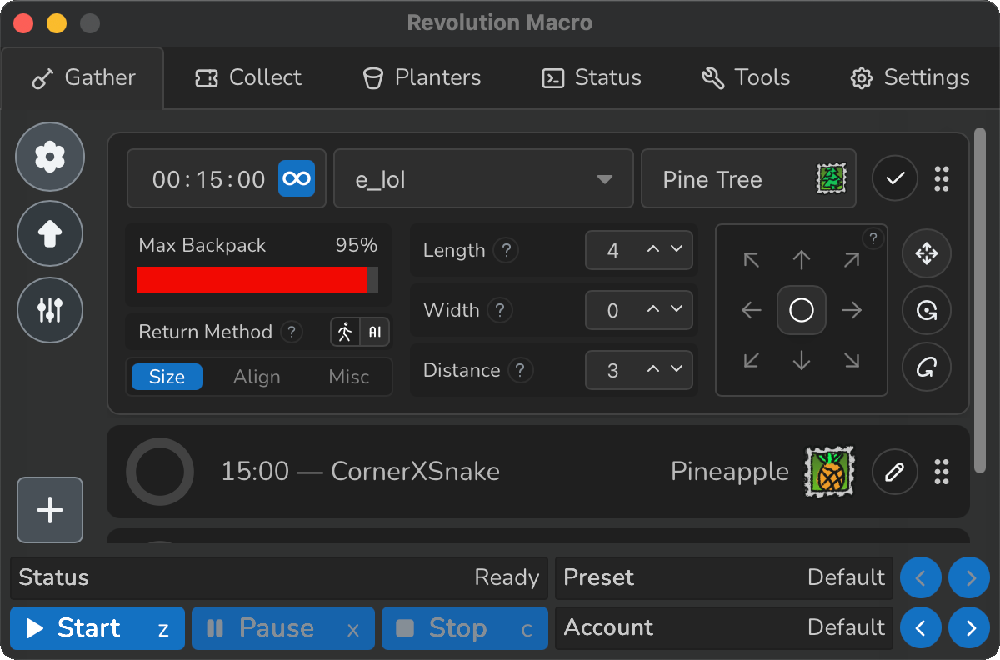
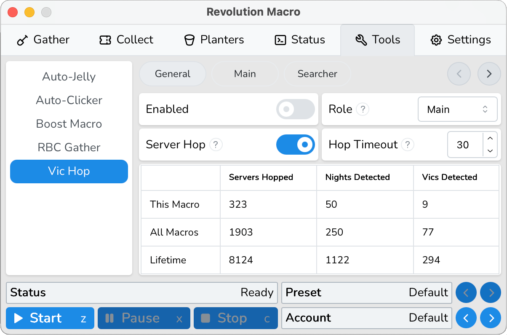

  <h1>Revolution</h1>

   &nbsp;&nbsp;  &nbsp;&nbsp; 

  

    A modern and highly efficient AI powered <a href="https://www.roblox.com/games/1537690962/Bee-Swarm-Simulator">Bee Swarm Simulator</a> macro, available for <strong>Windows</strong>, <strong>macOS</strong>, and soon available on various <strong>Linux</strong> distros as well.
  

<ul>
  <li><strong>AI Vicious Hopper</strong> ~ Public server hopping with practical AI detection and locator support.</li>
  <li><strong>AI Pathfinding</strong> ~ Uses advanced AI pathfinding to efficiently find the shortest path to areas without resetting.</li>
  <li><strong>Gathering</strong> ~ Easily pick a field to gather pollen from automatically, with a beautiful and modern UI.</li>
  <li><strong>Dispensers</strong> ~ Automatically pathfinds and gathers from any dispenser in the game.</li>
</ul>

---

  
 <strong>See More Info</strong>
 

  <table cellpadding="10">
    <tr>
      <td valign="top">
        <h4 align="center">Made for Pros</h4>
        
More advanced features, such as Boosting Macros, and Mondo Hopping are coming soon for expert players.

        <h5></h5>
      </td>
      <td valign="top">
        <h4 align="center">Cross Platform</h4>
        
Works seamlessly on both Windows and macOS, having Linux support coming soon.

      </td>
    </tr>
    <tr>
      <td valign="top">
        <h4 align="center">Actively Maintained</h4>
        
Regular updates, bug patches, and new features come regularly with little-to-no issues.

        <h5></h5>
      </td>
      <td valign="top">
        <h4 align="center">Active Community and Staff</h4>
        
Get quick and detailed support, or just general Bee Swarm game advice from our helpful Discord community

      </td>
    </tr>
  </table>

  
 <strong>See Images</strong>
 
  
    ㅤㅤㅤ  ㅤㅤㅤ  

---

## Author ❤️

Revolution's a solo project, written by Liam. Your support is my motivation to keep Revolution going and bring you all more updates!

> **Need help?** Find me on Discord by [clicking here](https://discord.com/users/910980823132561428) (@liammuwu)

## Installation

Install Revolution for Windows and macOS in the [releases](https://github.com/nosyliam/revolution-macro/releases) page, and join [our official Discord](https://discord.gg/revolutionmacro) to become a tester, access guides, and receive priority support!
