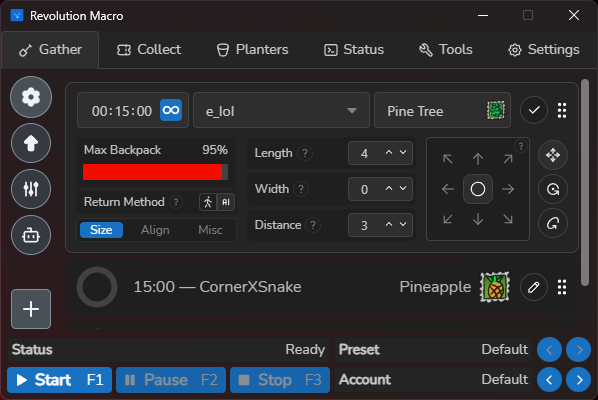

# Revolution Macro

  

  <b>The next generation of Bee Swarm Simulator automation.</b> 
  Built from the ground up for performance, precision, and ease of use.

  
  
  

---

## Overview

Revolution Macro is a new Bee Swarm Simulator macro for **Windows** and **macOS** that has been designed from the ground-up to offer an innovative macro experience. Sporting a modern interface and advanced features that integrate AI, Revolution will be the last macro that you'll ever use.

## Features

Some of the features included right now are:

* **AI Stinger Hop**: Public server hop with advanced AI detection and searcher support.
* **AI Pathfinding**: Advanced algorithms allow your character to go from task-to-task without needing to reset, finding the most optimized route each time. Advanced shortcuts like portals and cannons fully supported!
* **Gathering**: Choose any amount of fields to gather in of your choosing with a modern and intuitive interface.
* **Dispensers**: Collect loot from every dispenser in the game without needing to reset after.

## Screenshots

  
  

## Getting Started

1. **Download**: Join the [**Discord Server**](https://discord.gg/revolutionmacro) to become a Beta Tester and access guides and priority support! Check out the [Releases](https://github.com/nosyliam/revolution-macro/releases) to download the latest version of Revolution.
2. **Permissions**: On macOS, ensure the app has the necessary Accessibility permissions to interact with the game.

## Built With

  
  
  

## Creator

Revolution Macro is a solo project created by Liam. Your support is what drives me to fulfill the vision for Revolution every single day! Have a question? Feel free to contact me on Discord, my tag is `liammuwu`

---

**Created by Liam**  
*Discord: `liammuwu`*
